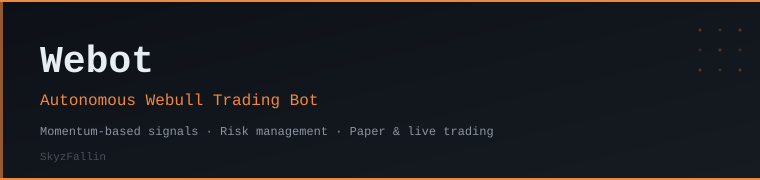

<p align="center">
  
</p>

<p align="center">
  
  
  
  
  
</p>

---

## Overview

**Webot** is a fully autonomous trading bot for [Webull](https://www.webull.com/) that executes trades on stocks and options using momentum-based indicators with built-in risk management. Supports both paper and live trading modes.

## Features

- **Webull API Integration** — Real-time market data and order execution
- **Dual Asset Classes** — Stocks and options
- **Momentum Indicators** — EMA/SMA crossovers and RSI-based signals
- **Risk Management** — Stop-loss, take-profit, trailing stops, and position sizing
- **Paper Trading Mode** — Test strategies without real capital
- **P&L Monitoring** — Real-time position tracking and performance metrics
- **Configuration-Driven** — YAML config + `.env` for credentials

## Project Structure

```
Webot/
├── bot/
│   ├── api/                    # Webull API wrapper
│   │   └── client.py
│   ├── strategy/               # Trading strategy modules
│   │   ├── indicators.py       # Technical indicators (EMA, SMA, RSI)
│   │   ├── signals.py          # Signal generation logic
│   │   └── risk.py             # Risk management
│   ├── execution/              # Order execution
│   │   ├── executor.py
│   │   └── paper_trading.py    # Paper trading simulator
│   ├── portfolio/              # Position tracking
│   │   └── manager.py
│   ├── config.py
│   ├── logger.py
│   └── main.py                 # Bot orchestrator
├── config/
│   ├── example_config.yaml
│   └── .env.example
├── tests/
│   ├── test_indicators.py
│   ├── test_signals.py
│   └── test_risk.py
├── main.py                     # Entry point
├── requirements.txt
├── setup.py
└── README.md
```

## Quick Start

```bash
# Clone
git clone https://github.com/SkyzFallin/Webot.git
cd Webot

# Virtual environment
python -m venv venv
source venv/bin/activate

# Install dependencies
pip install -r requirements.txt

# Configure credentials
cp config/.env.example .env
# Edit .env with your Webull credentials

# Configure strategy
cp config/example_config.yaml config/trading_config.yaml

# Run in paper mode
python main.py --mode paper
```

## Configuration

### Credentials (`.env`)

```env
WEBULL_USERNAME=your_email@example.com
WEBULL_PASSWORD=your_password
WEBULL_DID=your_device_id
WEBULL_TRADING_PIN=your_trading_pin
TRADING_MODE=paper
```

> ⚠️ **Never commit `.env` to version control.**

### Strategy (`config/trading_config.yaml`)

Key parameters include watchlist symbols, RSI thresholds (oversold/overbought), EMA periods (fast/slow), stop-loss/take-profit percentages, position sizing method, and max concurrent positions. See `config/example_config.yaml` for the full template.

## Usage

```bash
python main.py --mode paper                          # Paper trading (default)
python main.py --mode live                           # Live trading
python main.py --mode paper --symbols AAPL,TSLA,SPY  # Override watchlist
python main.py --dry-run                             # Print actions only
```

### Monitoring

```bash
tail -f logs/trading.log     # System events
tail -f logs/trades.csv      # Trade execution log
```

## Trading Logic

**Signal Generation:**
1. **RSI** — Buy below oversold threshold, sell above overbought
2. **MA Crossover** — Buy on fast EMA crossing above slow EMA, sell on cross below
3. **Volume Confirmation** — Optional filter requiring above-average volume

**Risk Management:**
- Position sizing based on account balance and risk tolerance
- Stop-loss and take-profit at configurable percentages
- Trailing stop to lock in profits
- Max daily loss circuit breaker
- Max concurrent positions limit

## Dependencies

Core: `webull-api`, `pandas`, `numpy`, `pyyaml`, `python-dotenv`, `requests`, `pytz`

## Testing

```bash
pytest tests/
pytest --cov=bot tests/
```

## Disclaimer

> ⚠️ This bot is for **educational and personal use only**. Past performance does not guarantee future results. Always test in paper trading mode first. Monitor the bot regularly. Never risk capital you cannot afford to lose.

## License

Personal use only. Not for redistribution without modification.

---

> This tool is for educational and informational purposes only — not financial advice. Past performance does not guarantee future results. Trade at your own risk.

---

<p align="center"><sub>Built by <a href="https://github.com/SkyzFallin">SkyzFallin</a></sub></p>
